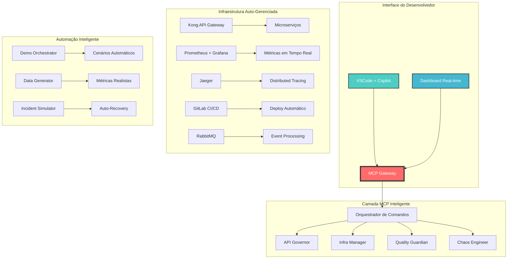

# 🚀 MCP DevOps Platform Demo

## Overview

The MCP DevOps Platform Demo showcases the power of Model Context Protocol (MCP) in a real-world DevOps environment. This platform demonstrates how AI agents can seamlessly interact with infrastructure, monitoring systems, and developer tools to provide an intelligent developer experience.

## Architecture



## Features

- **Intelligent DevOps Interface**: Natural language interface for complex DevOps tasks
- **API Governance**: Automated API contract validation, security audits, and monitoring
- **Infrastructure Management**: Automated scaling, deployment, and chaos engineering
- **Observability**: Integrated metrics, tracing, and logging with intelligent analysis
- **Demo Orchestration**: Realistic traffic patterns and scenarios for demonstration

## Quick Start

```bash
# Start the entire platform
./start-demo.sh

# Access the dashboard
open http://localhost:3001

# Try example prompts in VSCode with Copilot
# - "Onboard me as a new developer to the payment team"
# - "Create a new recommendations API with ML integration"
# - "Investigate high latency in the user service"
```

## Components

- **MCP Gateway**: Central intelligence layer connecting LLMs to infrastructure
- **Demo Orchestrator**: Creates realistic scenarios and traffic patterns
- **Microservices**: Sample services demonstrating the platform capabilities
- **Dashboard**: Real-time visualization of platform activities

## Prerequisites

- Docker and Docker Compose
- Node.js 18+
- Python 3.10+
- 8GB+ RAM available

## Architecture Details

The platform consists of the following key components:

1. **MCP Gateway**: Python-based MCP server that handles all LLM interactions and routes commands
2. **Infrastructure Layer**: Kong, Prometheus, Grafana, Jaeger, and RabbitMQ
3. **Microservices**: Sample services (user, payment, order) with realistic behavior
4. **Demo Orchestrator**: Generates traffic and simulates real-world scenarios
5. **Dashboard**: React-based real-time visualization of platform activities

## Demo Scenarios

The platform includes several pre-configured scenarios:

1. **Developer Onboarding**: Complete developer setup with personalized resources
2. **API Creation and Governance**: Create and manage APIs with built-in best practices
3. **Incident Investigation**: AI-assisted root cause analysis and remediation
4. **Chaos Engineering**: Controlled failure injection and resilience testing
5. **Performance Optimization**: Automated scaling and performance tuning

Each scenario demonstrates how MCP enables more natural and efficient DevOps workflows.

## License

MIT 